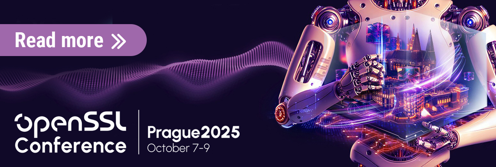

---
hide:
  - navigation
  - toc
search:
  exclude: true
---

# Home

A good starting point for understanding some of the key concepts in OpenSSL 3.0 is the libcrypto
[manual page](/master/man7/ossl-guide-libcrypto-introduction). Information and notes about
migrating existing applications to OpenSSL 3.0 are available in the
[OpenSSL 3.0 Migration Guide](/3.0/man7/migration_guide).

Information related to the OpenSSL FIPS Validation [FIPS 140-2 validation](fips.md) is also
available.

